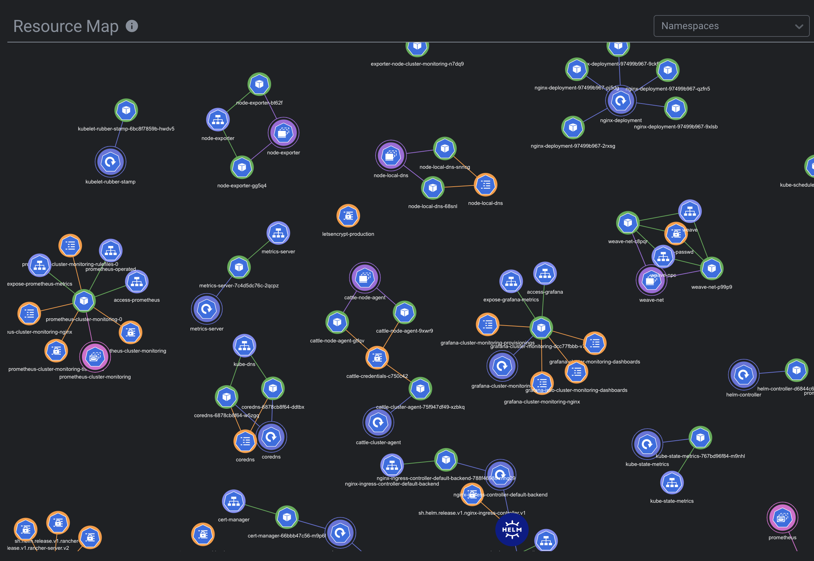

# Lens Resource Map

Lens Resource Map is an extension for [Lens - The Kubernetes IDE](https://k8slens.dev) that displays Kubernetes resources and their relations as a real-time force-directed graph.

## Installation

1. Install [Lens](https://k8slens.dev), if not installed.

2. Download extension package (tgz) from the [latest release](https://github.com/nevalla/lens-resource-map-extension/releases/latest) and [install](https://docs.k8slens.dev/v4.0.8/extensions/usage/#installing-an-extension) it to Lens.
