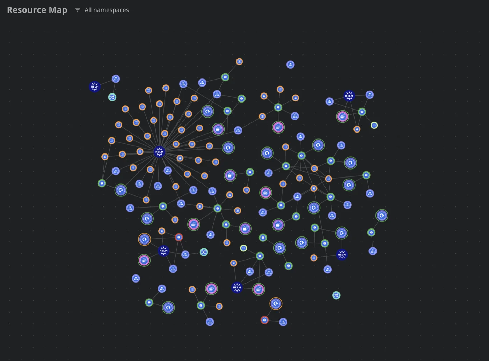

# Lens Resource Map

See how the resources of a Kubernetes cluster relate to each other, drawn as a live graph: which pods a Deployment runs, which Services and Ingresses route to them, which ConfigMaps, Secrets and volume claims they use, and which Helm release installed them.

## Features

- **Resource Map of a cluster**: every workload, Service, Ingress, ConfigMap, Secret, PersistentVolumeClaim and Helm release of the cluster, and how they connect. Pods are coloured by their status, and the map follows the cluster as it changes.
- **Namespace filter**: show every namespace, or pick the ones you want. The choice is remembered per cluster.
- **Resource Map in the details panel**: the details of a Deployment, StatefulSet, DaemonSet, Job, CronJob, Pod, Service, Ingress, ConfigMap, Secret or PersistentVolumeClaim show what that resource is connected to.
- Hover a resource to see a summary of it, click it to open its details.

## Install

[Open Resource Map in Lens](https://app.k8slens.dev/lens-launcher?c=lens%3A%2F%2Fapp%2Fopen%2Fextension%3Fname%3D@nevalla/kube-resource-map) and click Install there. The link offers Lens for download when it is not installed yet.

## Usage

- In the navigator, open a cluster and click **Resource Map**. The map opens in a tab of its own. Use the namespace button above the map to narrow it down.
- Select a resource in any of Lens's lists: its details panel has a **Resource Map** section.

Kinds you are not allowed to list in a cluster are left out of the map, and the map says which.

### Older Lens versions

Version 2 works with the current Lens only. On Lens 5 or 6, install version 1.x instead: `@nevalla/kube-resource-map@1.1.0`.

What changed in each version is in [CHANGELOG.md](./CHANGELOG.md).
